# Sample: Manage asset collections

You can use the Collection Management sample to list and manage the collections of asset in your Projects.

The SDK supports different workflows for users with different roles.

| Asset Manager Project role                                                                           | List an asset's collections | Add/remove assets in collections |
|:-----------------------------------------------------------------------------------------------------|:----------------------------|:---------------------------------|
| [`Asset Management Viewer`](https://docs.unity.com/cloud/en-us/asset-manager/org-project-roles)      | yes                         | no                               |
| [`Asset Management Consumer`](https://docs.unity.com/cloud/en-us/asset-manager/org-project-roles)    | yes                         | no                               |
| [`Asset Management Contributor`](https://docs.unity.com/cloud/en-us/asset-manager/org-project-roles) | yes                         | yes                              |
| [`Asset Management Owner`](https://docs.unity.com/cloud/en-us/accounts/roles-and-permissions)        | yes                         | yes                              |

## Before you start

Before you can use the Collection Management sample, you must have the following:

* Installed [Assets](installation.md) package
* Installed [Identity](https://docs.unity3d.com/Packages/com.unity.cloud.identity@latest) package
* A valid [Unity ID Account](https://id.unity.com/)
* Access to your [Unity Gaming Services account](https://dashboard.unity3d.com/)
* A Unity Project with the Asset Manager service enabled, see: [Assets documentation](https://docs.unity3d.com/docs-asset-manager/manual/modify-project.html)
* Access to the [Asset Manager service](https://docs.unity3d.com/docs-asset-manager/manual/get-started.html)
* At least one published asset in an Asset Manager Project, see: [Asset Manager documentation](https://docs.unity3d.com/docs-asset-manager/manual/add-asset.html)

>[!NOTE]
>While the Assets package itself doesn't depend on the Identity service, it is necessary in the sample to control the authentication process.

## Install the sample

To install the sample, follow these steps:

1. Inside your Unity Project window, go to **Package Manager** > **Unity Cloud Assets**.
2. Expand the **Samples** section.
3. On the right of the Collection Management sample, select **Import**.

   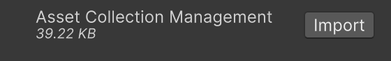

After the import process is complete, you can view your imported assets under the `Assets/Samples/Unity Cloud Assets` folder.

  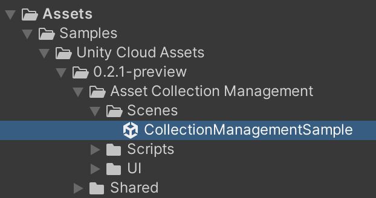

## Run the sample

To run the sample, follow these steps:

1. Go to `Assets/Samples/Unity Cloud Assets/<package-version>/Asset Collection Management/Scenes/CollectionManagementSample.unity` and run the scene.
2. Select an Organization. The left column displays the list of Projects from that Organization.

   
   
3. Select a Project. The list of collections for that Project will be displayed in the middle column. The right column displays the list of assets for a selected collection.

   

   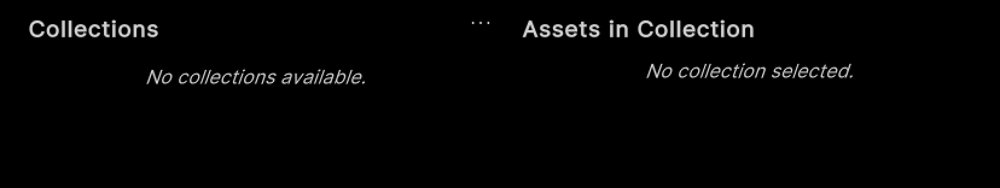

### Create a new collection

To create a new collection, follow these steps:

1. Next to the `Collections` label, select the **...** button  to open the context menu.

   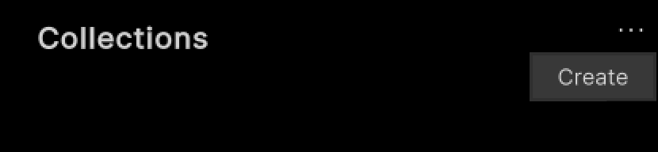
   
2. Select **Create**.

   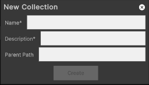

3. Enter a name and a description for the collection.
4. (Optional) enter a parent path.
5. Select **Create**.

   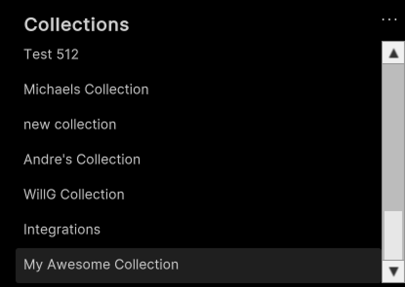

### Edit an existing collection

To edit an existing collection, follow these steps:

1. Select one of the collections in the list.
2. Next to the `Collections` label, select the **...** button to open the context menu.

   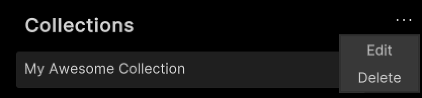
   
3. Select **Edit**.

   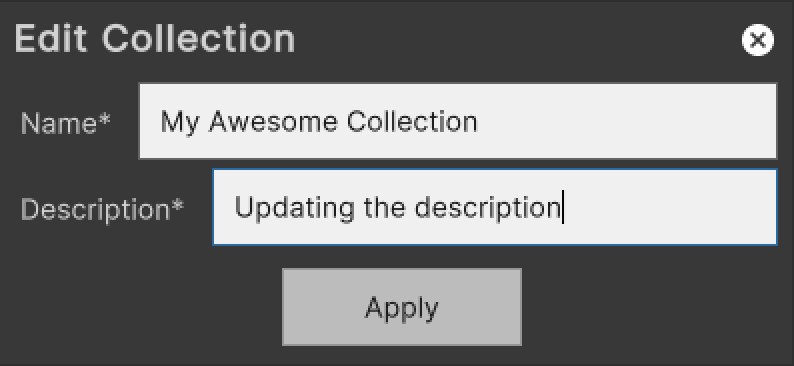
   
4. Enter a new name and a new description for the collection.
5. Select **Apply**.

#### Delete an existing collection

To delete an existing collection, follow these steps:

1. Select one of the collections in the list.
2. Next to the `Collections` label, select the **...** button to open the context menu.

   

3. Select **Delete**.

### Add assets to a collection

To add an asset to a collection, follow these steps:

1. Select one of the collections in the list.
2. Next to the `Assets in Collection` label, select the **...** button to open the context menu.

   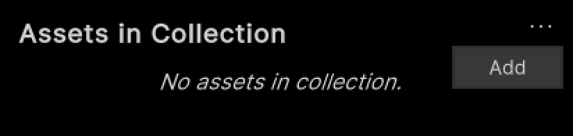
   
3. Select **Add**.

   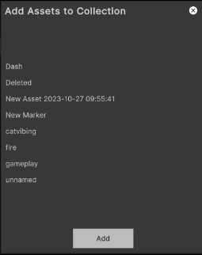

4. Select all the assets you want to add to the collection. 
5. Select **Add**.

   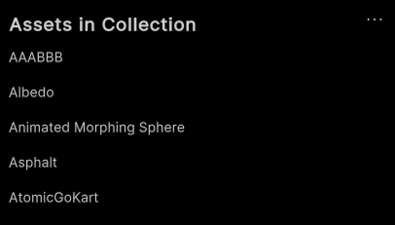

### Remove assets from a collection

To remove an asset from a collection, follow these steps:

1. Select one of the assets in the list.
2. Next to the `Assets in Collection` label, select **...** to open the context menu.

   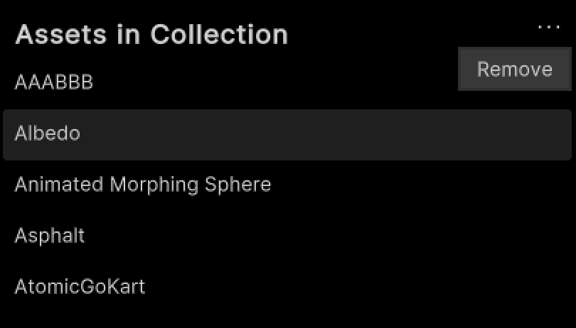
3. Select **Remove**.

## Main components

This section describes the scripts that make up the main components of the Asset Collection Management sample.

### Platform services script

The `PlatformServices` class initializes and disposes of dependencies required by the `IAssetRepository`. You can use this class to retrieve the `IAssetProject` you want to modify.

To open the platform services script, go to your `Assets/Samples/Unity Cloud Assets/<package-version>/Shared/Scripts/Services/PlatformServices.cs` file.

The `PlatformServices` class has two accompanying classes called `PlatformServicesInitialization` and `PlatformServicesShutdown` that call the initialization and shutdown methods through Unity's standard `Monobehaviour` methods `Awake()`, `Start()` and `OnDestroy()`.

### User Controller script

The `UserController` class makes it so you can sign into your application and uses your ID to grant access to the Collection Management sample. For more information on authentication, see the **Get user information** use case in the  [Identity package documentation](https://docs.unity3d.com/Packages/com.unity.cloud.identity@latest).

To open the UserController script, go to your `Assets/Samples/Unity Cloud Assets/<package-version>/Shared/Scripts/Controllers/UserController.cs` file.

### Asset collection management sample script

The `CollectionManagementSample` shows you how to do the following:

* Integrate the login flow with the `UserController` class
* Retrieve Organizations and Projects from the Asset Manager service
* Retrieve published assets from the Asset Manager service
* Search for assets by tag or name

To open the Collection Management sample script, go to your `Assets/Samples/Unity Cloud Assets/<package-version>/Asset Collection Management/Scripts/CollectionManagementSample.cs` file.

### Collection list, asset list, and collection asset list UI scripts

* The `CollectionListUi`, `AssetListUi`, and `CollectionAssetListUi` classes list the assets, collections, and assets belonging to a collection in the sample.
* The `AssetPanelUi` class bridges data between `AssetListUi` and `CollectionAssetListUi`.

### Shared UI scripts

The sample includes a set of UI scripts and prefabs. To open shared UI scripts, go to `Assets/Samples/Unity Cloud Assets/<package-version>/Shared/Scripts/Controllers`.

## Troubleshooting

Refer to the [troubleshooting](troubleshooting.md#sample-issues) section for help with sample issues.
