# Sample: Create and upload Unity Editor assets

You can use the Asset Database Uploader sample in the Unity Editor to create and upload assets from your Unity project into your Unity Cloud project.
By creating them and uploading them, your assets will be available in the Unity Asset Manager dashboard.

The sample use the management endpoints that requires a minimum role of:

* [**Manager**](https://docs.unity3d.com/docs-asset-manager/manual/manage-users.html) in the Unity Cloud Organization you belong to.  
OR 
* [**Asset Manager Contributor**](https://docs.unity3d.com/docs-asset-manager/manual/manage-users.html) in the Unity Cloud Project you belong to.

## Before you start

Before you use the Asset Database Uploader sample, you must have the following:

* An installed [Assets](installation.md) package
* An installed [Identity](https://docs.unity3d.com/Packages/com.unity.cloud.identity@latest) package
* A valid [Unity ID account](https://dashboard.unity3d.com/)
* Access to [Asset Manager service](https://docs.unity3d.com/docs-asset-manager/manual/get-started.html)
* A Unity project with the Asset Manager service enabled (see [Asset Manager documentation](https://docs.unity3d.com/docs-asset-manager/manual/modify-project.html))

> **Note**: While the Assets package doesn't depend on the Identity service, it is used in the sample to control the authentication flow.

## Install the sample

To install the sample, follow these steps:

1. In your Unity project window, go to **Package Manager** > **Unity Cloud Assets**.

2. Expand the **Samples** section and select **Import** next to the Asset Database Uploader sample.
   
   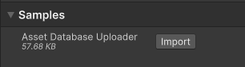

   After the import process is complete, you can view your imported assets in the `Assets/Samples/Unity Cloud Assets` folder.

   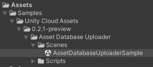

## Run the sample

To run the sample, follow these steps:

1. Go to `Assets/Samples/Unity Cloud Assets/<package-version>/Asset Database Uploader/Scenes/AssetDatabaseUploaderSample.unity` and open the scene. If this is your first time launching the sample, make sure to sign in with your Unity Gaming Services account. 
2. Select the `AssetDatabaseUploader` game object in the Hierarchy window.
3. In the inspector window, select the `Fetch Organizations and Projects` button.
    
   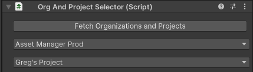
4. Select the organization where you want to upload your assets to.
    
   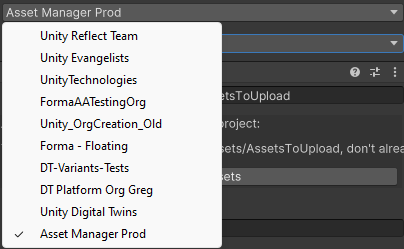
5. Select the project where you want to upload your assets to.
    
   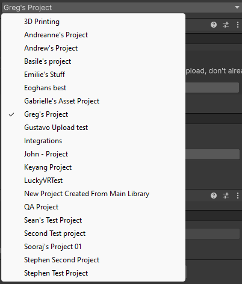
6. Set the folder path that contains your assets to upload.
    
   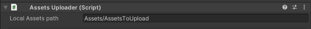
7. If you want to check which asset is already known in your Unity Cloud project, select the `Search Assets` button.
    
   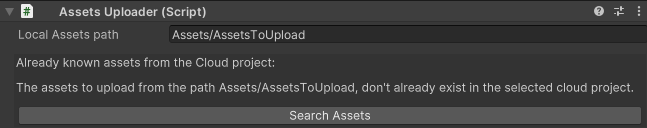
8. To upload your assets, select the `Create and Upload Assets` button.
    
   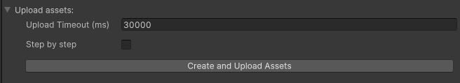

> **Note**: The script is basic and doesn't handle asset defined by multiple files. Each file is seen as a new asset.
> Also, all the uploaded assets are set with draft status. The script doesn't provide a way to change the status of an asset.

   

The sample provide two time out settings:

* One for the main queries like Fetch and Search for example.
* One for the upload process.

   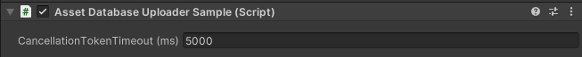

To change the upload timeout, select the `AssetDatabaseUploader` game object in the Hierarchy window. In the Inspector window, change the `Upload Time Out` value.

   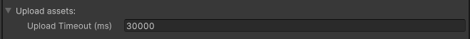

## Main components

This section describes the scripts that make up the main components of the Asset Database Uploader sample.

### AssetsEditor services script

The `AssetsEditorServices` class initializes and disposes of dependencies required by `AssetManager` and `AssetFileManager`. You can use this class to manage the Unity Cloud services and dependencies you use in your scripts.

To open the AssetsEditor services script, go to your `Assets/Samples/Unity Cloud Assets/<package-version>/AssetDatabaseUploader/Scripts/AssetsEditorServices.cs` file.

### Organization and Project selector script

The `OrgAndProjectSelector` script shows you how to do the following:

* Retrieve organizations and projects from the Asset Manager service
* Select an organization and project from a list of organizations and projects

To open the OrgAndProjectSelector script, go to your `Assets/Samples/Unity Cloud Assets/<package-version>/AssetDatabaseUploader/Scripts/OrgAndProjectSelector.cs` file.

### Assets Uploader script

The `AssetsUploader` script shows you how to do the following:

* Create an asset in a Unity Cloud project
* Create an asset file and attach it to the created asset
* Upload asset file contents

To open the AssetsUploader script, go to your `Assets/Samples/Unity Cloud Assets/<package-version>/AssetDatabaseUploader/Scripts/AssetsUploader.cs` file.

The `AssetsUploader` class has one required component called `OrgAndProjectSelector`.

### Asset Database Uploader sample script

The `AssetDatabaseUploaderSample` shows you how to do the following:

* Integrate everything together the `AssetsEditorServices`, the `OrgAndProjectSelector` and the `AssetsUploader` scripts
* Use the `AssetsEditorServices` class to get your authentication token
* Use the `AssetsEditorServices` class to initialize the `OrganizationProvider`, `ProjectProvider`, `AssetManager`, `AssetFileManager`
* Initialize the `OrgAndProjectSelector` script
* Initialize the `AssetsUploader` script

To open the Asset Database Uploader sample script, go to your `Assets/Samples/Unity Cloud Assets/<package-version>/AssetDatabaseUploader/Scripts/AssetDatabaseUploaderSample.cs` file.

### Inspector UI scripts

The sample includes a set of Editor UI scripts. To open the scripts, go to `Assets/Samples/Unity Cloud Assets/<package-version>/AssetDatabaseUploader/Scripts/Editor`.

### Limitations

The sample has the following limitations:

* If your asset already exists in your Unity Cloud project, the sample will not update your asset nor upload the file content. It will just skip it.
For now, the API endpoints don't support to get the upload URL of an asset if the file and the content has not been created and uploaded as the same time than the Asset's creation.

* Allows you to create 1 asset per 'file', you can add rules of your own to combine asset based on 'naming convention, or anything else'.
An example would be to combine all files that have the same letters before the first _ .
The example of files below would create 2 assets.

`Marble014_8K_Roughness.png`
`Marble014_8K_NormalGL.png`
`Marble014_8K_NormalDX.png`
`Marble014_8K_Displacement.png`
`Marble014_8K_Color.png`
`Marble014_PREVIEW.jpg`
`Marble014_8K-PNG.usdc`
`Rock030_PREVIEW.jpg`
`Rock030_8K_Roughness.png`
`Rock030_8K_NormalGL.png`
`Rock030_8K_NormalDX.png`
`Rock030_8K_Displacement.png`
`Rock030_8K_Color.png`
`Rock030_8K_AmbientOcclusion.png`

## Go further with your sample

This section describes other things you can do with the Asset Database Uploader sample.

### Step-by-step mode

The sample provide a step by step mode to help you understand how the script works. If you want to follow each step instead of doing everything with one selection, enable the step by step mode.

<ol>
   <li> To enable the step by step mode, select the <code>AssetDatabaseUploader</code> game object in the Hierarchy window. </li>
   <li> In the inspector window, check the <code>Step By Step</code> checkbox. </li>
       
   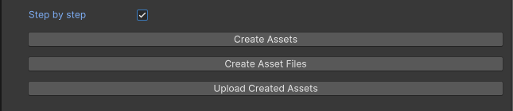
   <li> Then like the <code>Create and Upload Assets</code> button, select each action button one by one following this order:
      <ol>
         <li> <code>Create Assets</code> </li>
         <li> <code>Create Asset Files</code> </li>
         <li> <code>Upload Created Assets</code> </li>
      </ol>
   </li>
</ol>

## Troubleshooting

Refer to the [troubleshooting](troubleshooting.md#sample-issues) section for help with sample issues.
