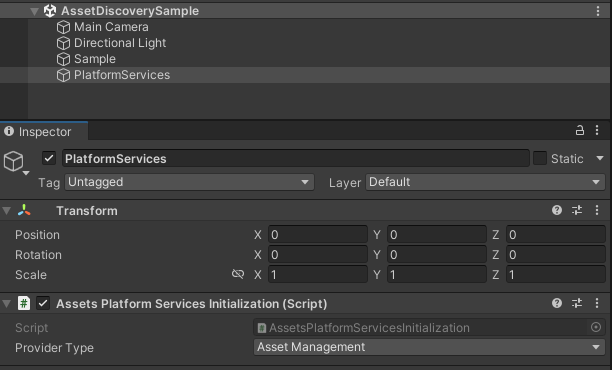

# Sample: Discover published assets

You can use the Asset discovery sample to search and download published assets from your organizations and projects.

The sample will only display published assets, using the discovery endpoints that requires only a 'user' permission.

## Prerequisites

Before you use the Asset Discovery sample, you must have the following:

* An installed [Assets](installation.md), and [Identity](https://docs.unity3d.com/Packages/com.unity.cloud.identity@0.16/manual/installation.html) packages
* A valid [Unity ID Account](https://dashboard.unity3d.com/) and [access to the asset manager service](https://docs.unity3d.com/docs-asset-manager/manual/get-started.html)
* At least 1 published asset in an Asset Management Project (see [Asset Manager documentation](https://docs.unity3d.com/docs-asset-manager/manual/add-asset.html))

> **Note**: While the Assets package doesn't depend on the Identity service, It is used in the sample to control the authentication flow.

## Installation

To install the sample, follow these steps:

1. Inside your Unity project window, go to **Package Manager** > **Unity Cloud Assets**.
2. Expand the **Samples** section and select **Import** next to the Asset Discovery sample.
    
   

After the import process is complete, you can view your imported assets under the `Assets/Samples/Unity Cloud Assets` folder.
 

## Run the sample

To run the sample, follow these steps:

1. Go to `Assets/Samples/Unity Cloud Assets/<package-version>/Asset Discovery/Scenes/AssetDiscoverySample.unity` and run the scene. If this is your first time launching the sample, make sure to sign in with your Unity Gaming Services account. For more information on creating a Unity project, see the [Asset Manager documentation](https://docs.unity3d.com/docs-asset-manager/manual/index.html).
2. Select an Organization. The list of projects from that organization will be displayed on the left column.
    
   
3. Select a project. The list of published assets from that project will be displayed on the right column.
    
   
    
   

### Search for specific assets

To search for specific assets by tag or name in this sample, follow these steps:

1. Select a project.
2. In the search bar, type the keywords by which you want to search your assets and click **Search**.
    
   
> **Note**: While using the sdk, you will be able to build different and more complex queries. For more information on asset search, see the [Search Assets manual](use-case-search-assets.md).

#### Search prompts

As you type in the search bar, the sample will display a list of keyword suggestions based on your search. These keywords are aggregated from the tags and names of your assets.
To select a keyword, click on it. The search bar will add it as a parameter and the sample will refresh the asset list to match the new search.

### See asset details and download files

To see your asset information in this sample, follow these steps:

1. Select one of the assets in the grid.
2. The asset details view will be displayed.
     
    
3. To download your asset files, click on **Download**.
> **Note**: To download assets, you will need the right permissions in your project to **consume** assets.

## Main components

This section describes the scripts that make up the main components of the Asset Discovery sample.

### Platform services script

The `PlatformServices` class initializes and disposes of dependencies required by the `AssetProvider`. You can use this class to manage the Unity Cloud services and dependencies you use in your application.

To open the platform services script, go to your `Assets/Samples/Unity Cloud Assets/<package-version>/Shared/Scripts/PlatformServices.cs` file.

The `PlatformServices` class has two accompanying classes called `PlatformServicesInitialization` and `PlatformServicesShutdown` that call the initialization and shutdown methods through Unity's standard `Monobehaviour` methods `Awake()`, `Start()` and `OnDestroy()`.

### User Controller script

The `ActiveUserController` class lets you sign in and provides the Asset Discovery sample with your Unity Gaming Services ID. For more information on authentication, see the [Identity package documentation](https://docs.unity3d.com/Packages/com.unity.cloud.identity@0.16/manual/use-case-getting-user-information.html).

To open the ActiveUserController script, go to your `Assets/Samples/Unity Cloud Assets/<package-version>/Shared/Scripts/UIController/ActiveuserController.cs` file.

### Asset Discovery sample script

The `AssetDiscoverySample` shows you how to do the following:

* Integrate the login flow with the `ActiveUserController` class
* Retrieve organizations and projects from the Asset Manager service
* Retrieve published assets from the Asset Manager service
* Search for assets by tag or name

To open the Asset Discovery sample script, go to your `Assets/Samples/Unity Cloud Assets/<package-version>/AssetDiscovery/Scripts/AssetDiscoverySample.cs` file.

### Shared UI scripts

The `UI` sample includes a set of UI scripts and prefabs used by our samples. To open shared UI scripts, go to `Assets/Samples/Unity Cloud Assets/<package-version>/Shared/Scripts/UIController`.

## Go further with your sample

This section describes other actions you can perform with the Asset Discovery sample.

### Search published, unpublished, and draft assets

If you want to search among all assets, not only the published assets, you can replace the Asset provider implementation to Asset Management instead of discovery by switching them in the AssetsPlatformServices.
     
    
     
> **Note**: The Asset Managemment provider type will use different endpoints that require a 'manager' permission. For more information on permissions, see the [Asset Manager documentation](https://docs.unity3d.com/docs-asset-manager/manual/modify-project.html).

## Troubleshoot

This section describes issues you might have while using the Asset Discovery sample.

### Missing dependency

If you get a missing dependency error about a specific package, ensure you have installed all the packages listed in the [Prerequisites](#prerequisites).

### The automatic browser redirection doesn't work

If you run the sample in the Unity Editor, you should see the following page after you successfully login through your browser.

If you aren't automatically redirected to the Editor and nothing happens when you select **Launch Application**, return to the Editor. This should continue the authentication process.

### I can't see my assets

If you can't see any assets, it might be that your organization doesn't have the asset management feature flag enabled. You'll need to [request access to the beta](https://docs.unity3d.com/docs-asset-manager/manual/request-access.html).
