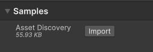
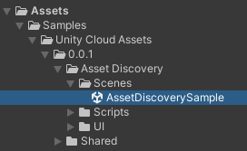
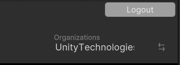
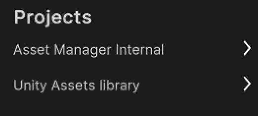
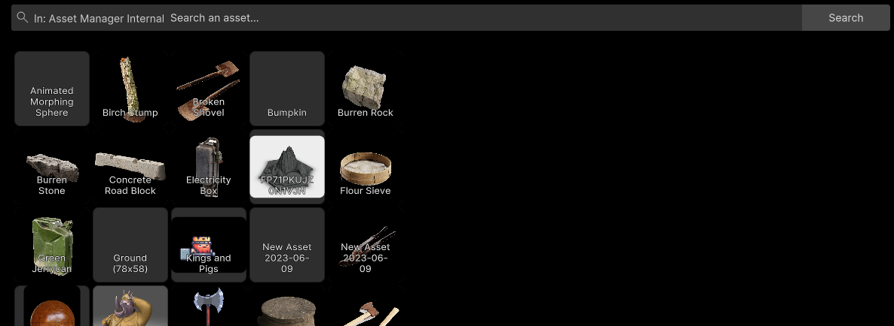
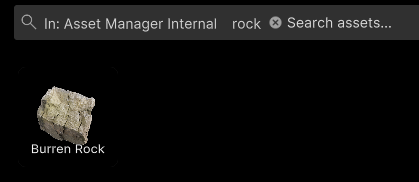
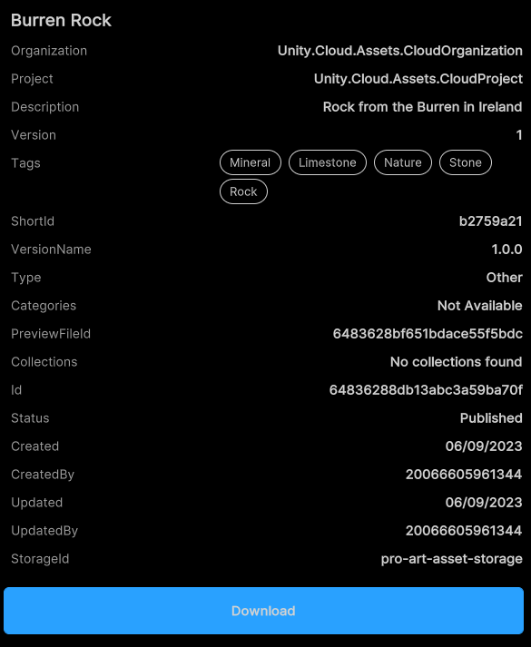

# Sample: Discover assets

You can use the Asset Discovery sample to search and download assets from your Organizations and Projects.

You can use the Unity Cloud Assets package to filter assets in a Project based on a set of search criteria.
You will need at least a Consumer Role to be able to download assets

| Asset Manager Project role                                                                             | Search | Download |
|:-------------------------------------------------------------------------------------------------------|:-------|:---------|
| [`Asset Management Viewer`](https://docs.unity3d.com/docs-asset-manager/manual/manage-users.html)      | yes    | No       |
| [`Asset Management Consumer`](https://docs.unity3d.com/docs-asset-manager/manual/manage-users.html)    | yes    | yes      |
| [`Asset Management Contributor`](https://docs.unity3d.com/docs-asset-manager/manual/manage-users.html) | yes    | yes      |
| [`Asset Management Owner`](https://docs.unity3d.com/docs-asset-manager/manual/manage-users.html)       | yes    | yes      |

## Before you start

Before you use the Asset Discovery sample, you must have the following:

* Installed [Assets](installation.md) package
* Installed [Identity](https://docs.unity3d.com/Packages/com.unity.cloud.identity@latest) package
* A valid [Unity ID Account](https://id.unity.com/)
* Access to your [Unity Gaming Services account](https://dashboard.unity3d.com/)
* Access to [Asset Manager service](https://docs.unity3d.com/docs-asset-manager/manual/get-started.html)
* At least one asset in an Asset Management Project, see: [Asset Manager documentation](https://docs.unity3d.com/docs-asset-manager/manual/add-asset.html)
* A Unity Project with the Asset Manager service enabled, see: [Asset Manager documentation](https://docs.unity3d.com/docs-asset-manager/manual/modify-project.html)

>[!NOTE]
>While the Assets package doesn't depend on the Identity service, it is used in the sample to control the authentication process.

## Install the sample

To install the sample, follow these steps:

1. In your Unity Project window, go to **Package Manager** > **Unity Cloud Assets**.
2. Expand the **Samples** section.
3. On the right of the Asset Discovery sample, select **Import**.

   

   After the import process is complete, you can view your imported assets in the `Assets/Samples/Unity Cloud Assets` folder.

   

## Run the sample

To run the sample, follow these steps:

1. Go to `Assets/Samples/Unity Cloud Assets/<package-version>/Asset Discovery/Scenes/AssetDiscoverySample.unity` and run the scene.
2. Select an Organization. The list of Projects from that Organization appears on the left column.
   </br>
   
3. Select a Project. The list of assets from that project appears on the right column.
   </br>
   
   </br>
   

### Search for specific assets

To search for specific assets by tag or name in this sample, follow these steps:

1. Select a Project.
2. In the search bar, type the keywords by which you want to search your assets and select **Search**.
   </br>
   

>[!NOTE]
>While using the SDK, you will be able to build different and more complex queries. For more information on asset search, see the [Search Assets manual](use-case-search-assets.md).

#### Search prompts

As you type in the search bar, the sample will display a list of keyword suggestions based on your search. These keywords are aggregated from the tags and names of your assets.
To select a keyword, click on it. The search bar will add it as a parameter and the sample will refresh the asset list to match the new search.

### See asset details and download files

To see your asset information in this sample, follow these steps:

1. Select one of the assets in the grid. The asset details view appears.
    </br>
    

2. To download your files, select **Download**.

To edit the download's filepath, update the `path` variable in `AssetInformationPanelController.OnAssetDownloadButtonClicked()`.
```C#
async void OnAssetDownloadButtonClicked()
{
    UpdateDownloadButton(false);

    var path = Environment.GetFolderPath(Environment.SpecialFolder.Desktop);
```

>[!NOTE]
>To download assets, you will need the right permissions in your Project to **consume** assets.

## Main components

This section describes the scripts that make up the main components of the Asset Discovery sample.

### Platform services script

The `PlatformServices` class initializes and disposes of dependencies required by the `IAssetRepository`. You can use this class to manage the Unity Cloud services and dependencies you use in your application.

To open the platform services script, go to your `Assets/Samples/Unity Cloud Assets/<package-version>/Shared/Scripts/Services/PlatformServices.cs` file.

The `PlatformServices` class has two accompanying classes called `PlatformServicesInitialization` and `PlatformServicesShutdown` that call the initialization and shutdown methods through Unity's standard `Monobehaviour` methods `Awake()`, `Start()` and `OnDestroy()`.

### User Controller script

The `UserController` class makes it so you can sign into your application and uses your ID to grant access to the Asset Discovery sample. For more information on authentication, see the **Get user information** use case in the [Identity package documentation](https://docs.unity3d.com/Packages/com.unity.cloud.identity@latest).

To open the UserController script, go to your `Assets/Samples/Unity Cloud Assets/<package-version>/Shared/Scripts/Controllers/UserController.cs` file.

### Asset Discovery sample script

The `AssetDiscoverySample` shows you how to do the following:

* Integrate the login flow with the `UserController` class.
* Retrieve Organizations and Projects from the Assets service.
* Retrieve assets from the Assets service.
* Search for assets by tag or name.

To open the Asset Discovery sample script, go to your `Assets/Samples/Unity Cloud Assets/<package-version>/AssetDiscovery/Scripts/AssetDiscoverySample.cs` file.

### Shared UI scripts

The `UI` sample includes a set of UI scripts and prefabs used by Unity Cloud Assets samples. To open shared UI scripts, go to `Assets/Samples/Unity Cloud Assets/<package-version>/Shared/Scripts/Controllers`.

## Go further with your sample

This section describes other actions you can perform with the Asset Discovery sample.

## Troubleshooting

Refer to the [troubleshooting](troubleshooting.md#sample-issues) section for help with sample issues.
