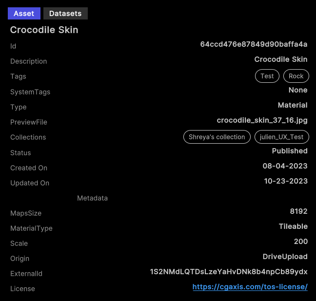

# Sample: Discover assets

Use the Asset Discovery sample to search and download assets from your organizations and projects.

Filter assets in a project based on a set of search criteria by using the Unity Cloud Assets package.

>[!NOTE]
>To download assets, you need the [`Asset Manager Admin`](https://docs.unity.com/cloud/en-us/asset-manager/org-project-roles#organization-level-roles) role at the organization level. At the project level, you need either the [`Asset Manager Contributor`]( https://docs.unity.com/cloud/en-us/asset-manager/org-project-roles#project-level-roles) or the [`Asset Manager Consumer`](https://docs.unity.com/cloud/en-us/asset-manager/org-project-roles#project-level-roles) add-on role. Asset Manager Contributors can manage assets only for the specific projects to which they have access.

## Before you start

Before you use the Asset Discovery sample, make sure you have the following:

* An installed [Assets](installation.md) package.
* An installed [Identity](https://docs.unity3d.com/Packages/com.unity.cloud.identity@latest) package.
* A valid [Unity ID account](https://id.unity.com/).
* Access to your [Unity Gaming Services account](https://dashboard.unity3d.com/).
* Access to the [Asset Manager service](https://docs.unity3d.com/docs-asset-manager/manual/get-started.html).
* At least one asset in an Asset Management project. Read more about [adding assets using the Asset SDK](get-started-management.md#Create-an-asset) and adding [a single asset](https://docs.unity.com/cloud/en-us/asset-manager/single-asset) or [multiple assets](https://docs.unity.com/cloud/en-us/asset-manager/multiple-assets) through the dashboard.
* A Unity project with the Asset Manager service enabled. Read more about [creating a Unity project](https://docs.unity.com/cloud/en-us/asset-manager/new-asset-manager-project).

>[!NOTE]
>Although the Assets package does not depend on the Identity service, the sample uses the service to control the authentication process.

## Known limitations

The Asset Discovery sample has the following limitations:

- Projects and organizations with a large number of assets may experience performance issues.
- When building the sample as a standalone application, the application may crash due to memory limitations.

## Install the sample

To install the sample, follow these steps:

1. In the Unity Editor, go to **Window** > **Package Manager** > **Unity Cloud Assets**.
2. Expand the **Samples** section.
3. Select **Import** next to `Asset Discovery`.

   

5. After the import process completes, check the imported sample in the `Assets/Samples/Unity Cloud Assets` folder.

   

## Run the sample

To run the sample, follow these steps:

1. Go to `Assets/Samples/Unity Cloud Assets/<package-version>/Asset Discovery/Scenes/AssetDiscoverySample.unity` and run the scene.
2. Select an organization. The list of projects from that organization appears on the left column.
 
   
3. Select a project. The list of assets from that project appears on the right column.

   

   

### Search for specific assets

To search for specific assets by tag or name in this sample, follow these steps:

1. Select a project.
2. In the search bar, do the following:
   1.  Select the search criteria: Name, Type, Status, Tags, System Tags, PreviewFile, or FileName.
   2.  Enter the keywords that you want to search for in asset tags and asset names.
   3.  Select **Search**.
  
   

>[!TIP]
>While using the SDK, build different and more complex queries. Read more about [asset search](use-case-search-assets.md).

#### Search prompts

As you enter text in the search bar, the sample suggests keywords that are derived from the tags and names of your assets.
Select a keyword. The sample updates the search results accordingly.

### Review the asset details and download the files

To view your asset information in this sample, select an asset in the grid. The asset details view appears.

The details view displays the following information about the selected asset:

* Name
* Description
* Tags
* System tags
* Collections
* Creation and last edit dates
* Name of users who created and last edited the asset
* Metadata

To download your asset information in this sample, follow these steps:

1. Select an asset in the table. The asset details view appears.
2. Select **Download**. The download location confirmation prompt appears.
3. Select **Ok** to download the asset.

>[!NOTE]
>To download assets, you need the [`Asset Manager Admin`](https://docs.unity.com/cloud/en-us/asset-manager/org-project-roles#organization-level-roles) role at the organization level. At the project level, you need either the [`Asset Manager Contributor`]( https://docs.unity.com/cloud/en-us/asset-manager/org-project-roles#project-level-roles) or the [`Asset Manager Consumer`](https://docs.unity.com/cloud/en-us/asset-manager/org-project-roles#project-level-roles) add-on role. Asset Manager Contributors can manage assets only for the specific projects to which they have access.

## Main components

This section describes the scripts that make up the main components of the Asset Discovery sample.

### Platform services script

The `PlatformServices` class handles the initialization and disposal of dependencies necessary for the `IAssetRepository` interface. Use this class to manage the Unity Cloud services and dependencies in your application.

To open the platform services script, go to your `Assets/Samples/Unity Cloud Assets/<package-version>/Shared/Scripts/Services/PlatformServices.cs` file.

Use the following classes with the `PlatformServices` class:

* `PlatformServicesInitialization` 
* `PlatformServicesShutdown`

These classes use the following standard Unity `Monobehaviour` methods to run the initialization and shutdown methods:

* `Awake()`
* `Start()`
* `OnDestroy()`

### Project controller script

The `ProjectController` class inherits the following from the `OrganizationController` class:

* Sign in to your application.
* Use your ID to grant access to the Asset Discovery sample.

Read more about [authentication](https://docs.unity3d.com/Packages/com.unity.cloud.identity@latest?subfolder=/manual/use-case-getting-user-information.html).
The `ProjectController` class uses the `IOrganizationRepository` interface of the `PlatformServices` class to retrieve the list of your organizations.
The `ProjectController` class uses the `IAssetRepository` interface of the `PlatformServices` class to retrieve the list of your projects for the selected organization.

To open the project controller script, go to your `Assets/Samples/Unity Cloud Assets/<package-version>/Shared/Scripts/Controllers/ProjectController.cs` file.

### Asset Discovery sample script

The `AssetDiscoverySample` shows you how to do the following:

* Integrate the login flow with the `ProjectController` class.
* Retrieve organizations and projects from the Assets service.
* Retrieve assets from the Assets service.
* Search for assets by tag or name.

To open the Asset Discovery sample script, go to your `Assets/Samples/Unity Cloud Assets/<package-version>/AssetDiscovery/Scripts/AssetDiscoverySample.cs` file.

### Shared UI scripts

The `UI` sample includes a set of UI scripts and prefabs that Unity Cloud Assets samples use. To open shared UI scripts, go to `Assets/Samples/Unity Cloud Assets/<package-version>/Shared/Scripts/Controllers`.

## Troubleshooting

In case of issues with samples, refer to [troubleshooting](troubleshooting.md#sample-issues).
