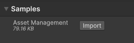
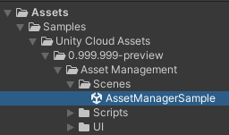
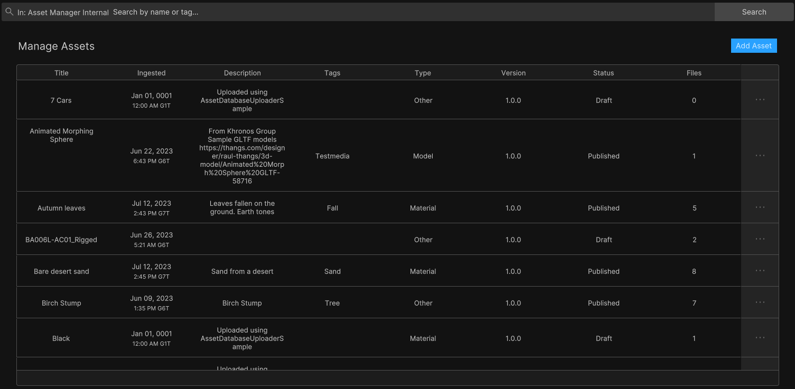
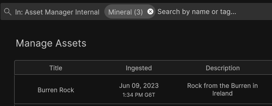
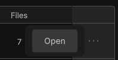
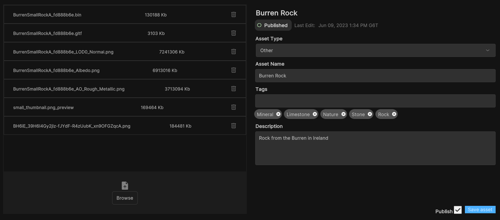
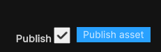
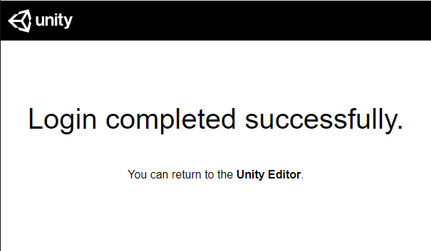

# Asset Management Sample

The sample available as part of the Unity Cloud Platform Assets SDK demonstrates how to update and publish assets.
A typical example of audience for this guide is the developers who want to integrate asset management features in their app.

The sample use the management endpoints that requires a minimum role of **Manager** in the Unity Cloud Organization you belong to OR a minimum role of **Asset Manager Contributor** in the Unity Cloud Project you belong to.

## Prerequisites

To use the Asset Management sample, you need the following:

* An installed [Assets](installation.md), and [Identity](https://docs.unity3d.com/Packages/com.unity.cloud.identity@0.16/manual/installation.html) packages
* A valid [Unity ID Account](https://dashboard.unity3d.com/) and [access to the asset manager service](https://docs.unity3d.com/docs-asset-manager/manual/get-started.html)

> **Note**: While the Assets package doesn't depend on the Identity service, It is used in the sample to control the authentication flow.

## Installation

To install the sample, follow these steps:

1. Inside your Unity project window, go to **Package Manager** > **Unity Cloud Assets**.

2. Expand the **Samples** section and select **Import** next to the Asset Management sample.
    
   

After the import process completes, you can view the imported assets in the `Unity Cloud Assets/Samples/Samples/Asset Management` folder.
 

## Run the sample

To run the sample, follow these steps:

1. Go to `Assets/Samples/Unity Cloud Assets/<package-version>/Asset Management/Scenes/AssetManagerSample.unity` and run the scene. If this is your first time launching the sample, make sure to sign in with your Unity Gaming Services account. For more information on creating a Unity project, see the [Asset Manager documentation](https://docs.unity3d.com/docs-asset-manager/manual/index.html).

2. Select an Organization. The list of projects from that organization will be displayed on the left column.
    
   

3. Select a project. The list of published assets from that project will be displayed on the right column.
    
   
    
   

### Search for specific assets

To search for specific assets by tag or name in this sample, follow these steps:

1. Select a project.
2. In the search bar, type the keywords by which you want to search your assets and click **Search**.
    
   
> **Note**: While using the sdk, you will be able to build different and more complex queries. For more information on asset search, see the [Search Assets manual](use-case-search-assets.md).

#### Search prompts

As you type in the search bar, the sample will display a list of keyword suggestions based on your search. These keywords are aggregated from the tags and names of your assets.
To select a keyword, click on it. The search bar will add it as a parameter and the sample will refresh the asset list to match the new search.

### Update/edit an asset

To update an asset in this sample, follow these steps:

1. Select a project.
2. On the right click on the **...** button of the asset you want to update and select **Open**.
    
   
3. In the asset details page, edit the asset's information and click on the **Save asset** button.
    
   
4. To go back to the list of assets of the project, click on the desired project in the project list.

> **Note**: When an asset is not published, you can do the two following actions :
> 1. you can save the asset by clicking on the **Save asset** button.
   
  
> 2. you can publish it by checking the Publish checkbox and clicking on the **Publish asset** button.
   
  

## Main components

This section describes the scripts that make up the main components of the Asset Management sample.

### Platform services script

The `PlatformServices` class initializes and disposes of dependencies required by the `AssetManager`. You can use this class to manage the Unity Cloud services and dependencies you use in your application.

To open the platform services script, go to your `Assets/Samples/Unity Cloud Assets/<package-version>/Shared/Scripts/Services/PlatformServices.cs` file.

The `PlatformServices` class has two accompanying classes called `PlatformServicesInitialization` and `PlatformServicesShutdown` that call the initialization and shutdown methods through Unity's standard `Monobehaviour` methods `Awake()`, `Start()` and `OnDestroy()`.

### User Controller script

The `UserController` class lets you sign in and provides the Asset Management sample with your Unity Gaming Services ID. For more information on authentication, see the [Identity package documentation](https://docs.unity3d.com/Packages/com.unity.cloud.identity@0.16/manual/use-case-getting-user-information.html).

To open the UserController script, go to your `Assets/Samples/Unity Cloud Assets/<package-version>/Shared/Scripts/Controllers/UserController.cs` file.

### Asset Management sample script

The `AssetManagerSample` shows you how to do the following:

* Integrate the login flow with the `UserController` class
* Retrieve organizations and projects from the Asset Manager service
* Retrieve assets from the Asset Manager service and manage them
* Search for assets by tag or name

To open the Asset Management sample script, go to your `Assets/Samples/Unity Cloud Assets/<package-version>/AssetManager/Scripts/AssetManagerSample.cs` file.

### Shared UI scripts

The `UI` sample includes a set of UI scripts and prefabs used by our samples. To open shared UI scripts, go to `Assets/Samples/Unity Cloud Assets/<package-version>/Shared/Scripts/Controllers`.

## Troubleshoot

This section describes issues you might have while using the Asset Management sample.

### Missing dependency

If you get a missing dependency error about a specific package, ensure you have installed all the packages listed in the [Prerequisites](#prerequisites).

### The automatic browser redirection doesn't work

If you run the sample in the Unity Editor, you should see the following page after you log in through your browser:

If you aren't automatically redirected to the Editor and if nothing happens when you select **Launch Application**, return to the Editor. This should continue the authentication process.

### I can't see my assets

If you can't see any assets, your organization may not have the Asset Management feature enabled. You'll need to [request access to the beta](https://docs.unity3d.com/docs-asset-manager/manual/request-access.html).
