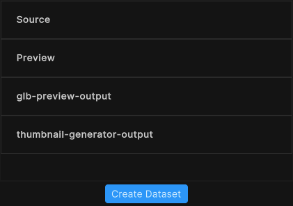
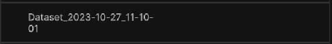
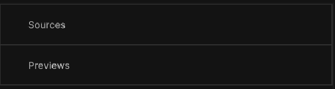
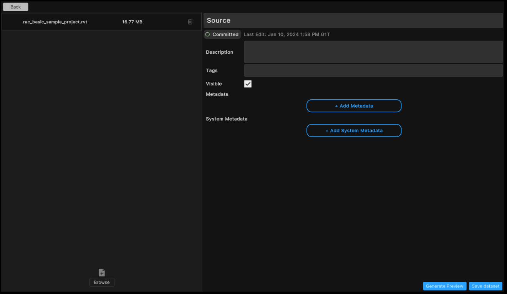
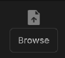
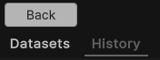

# Sample: Manage assets

The sample available as part of the Unity Cloud Assets demonstrates how to update and publish assets.
A typical example of audience for this guide is the developers who want to integrate asset management features in their app.

The sample use the management endpoints that requires a minimum role of:

* [`Asset Management Contributor`](https://docs.unity.com/cloud/en-us/asset-manager/org-project-roles).   
OR 
* [`Organization Owner`](https://docs.unity.com/cloud/en-us/accounts/roles-and-permissions).

## Before you start

To use the Asset Management sample, you need the following:

* Installed [Assets](installation.md) package
* Installed [Identity](https://docs.unity3d.com/Packages/com.unity.cloud.identity@latest) package
* A valid [Unity ID Account](https://id.unity.com/)
* Access to your [Unity Gaming Services account](https://dashboard.unity3d.com/)
* Access to the [Asset Manager service](https://docs.unity3d.com/docs-asset-manager/manual/get-started.html)
* A Unity Project with the Asset Manager service enabled, see: [Asset Manager documentation](https://docs.unity3d.com/docs-asset-manager/manual/modify-project.html)

>[!NOTE]
>While the Assets package doesn't depend on the Identity service, it is used in the sample to control the authentication process.

## Install the sample

To install the sample, follow these steps:

1. Inside your Unity Project window, go to **Package Manager** > **Unity Cloud Assets**.
2. Expand the **Samples** section.
3. On the right of the Asset Management sample, select **Import**.

   

4. After the import process completes, you can view the imported sample in the `Unity Cloud Assets/Samples/Samples/Asset Management` folder.
   
   

## Run the sample

To run the sample, follow these steps:

1. Go to `Assets/Samples/Unity Cloud Assets/<package-version>/Asset Management/Scenes/AssetManagerSample.unity` and run the scene.
2. Select an Organization. The list of Projects from that Organization appears on the left column.
    
   
3. Select a Project. The list of assets from that Project appears on the right column.
    
   
    
   

### Search for specific assets

To search for specific assets by tag or name in this sample, follow these steps:

1. Select a Project.
2. In the search bar, type the keywords by which you want to search your assets and select **Search**.
    
   

>[!NOTE]
>While using the SDK, you will be able to build different and more complex queries. For more information on asset search, see the [Search Assets](use-case-search-assets.md) use case.

#### Search prompts

As you type in the search bar, the sample will display a list of keyword suggestions based on your search. These keywords are aggregated from the tags and names of your assets.
To select a keyword, select it. The search bar will add it as a parameter and the sample will refresh the asset list to match the new search.

### Update/edit an asset

An asset can only be updated if it is not frozen and its status is 'Draft'. To update an asset in this sample, follow these steps:

1. Select a Project.
2. On the right side of the screen, select **...** button of the asset you want to update and select **Open**.
    
   
3. In the asset details page, edit the asset's information and select the **Save asset** button. Add metadata to the asset by selecting the **Add Metadata** button.
    
   
4. To add a new dataset to the asset, select the **Create dataset** button.
    
   
5. A new dataset with an automatic name is added to the asset.
     
   
6. To update a dataset or manage the files of an asset, you can select the desired dataset.
    
   
7. In the dataset details page, edit the dataset's information and select the **Save dataset** button.
    
   
8. In the dataset details page, you can start a workflow to generate a thumbnail by selecting the **Generate preview** button. This will create a new dataset containing an image file.
9. To add a new file to the dataset, select the **Browse** button, select the desired file. If a dataset possesses at least one file, you can generate a preview image by selecting **Generate Preview** button.
    
   
10. To remove a file from the dataset, select the **Trash icon** button.
     
    
11. To go back to the detail of the asset, select the **Back** button in the top left corner.
12. To go back to the list of assets of the Project, select the **Back** button in the top left corner.

>[!NOTE]
>When an asset is not frozen, you can do the following actions :
> 1. You can save the asset by selecting the **Save changes** button.
> 
> 2. You can publish it by selecting the **Publish** button.
> 
> 3. You can freeze the asset by selecting the **Save version** button.
>
> 
>  
> 4. **Sources** dataset is the default dataset of an asset used to list the asset data files.
> 5. **Previews** dataset is default dataset of an asset to list the asset preview files.
>
> 
>When an asset is frozen, you can do the following actions :
> 1. You can publish it by selecting the **Publish** button.
>
> 2. You can create a new version based off the current version by selecting the **Continue editing** button.
>
> 
>
> 3. **Sources** dataset is the default dataset of an asset used to list the asset data files.
> 4. **Previews** dataset is default dataset of an asset to list the asset preview files.

### Browse the asset's version history

By default, the details panel displays the list of datasets for the default version of the asset. To browse the asset's version history in this sample, follow these steps once an asset is selected:

1. To browse the asset's version history, select the **History** tab.
    
   
2. In the asset's version history, you can select a version to view its details.
3. To go back to the asset's datasets, select the **Datasets** tab.

## Main components

This section describes the scripts that make up the main components of the Asset Management sample.

### Platform services script

The `PlatformServices` class initializes and disposes of dependencies required by the `IAssetRepository`. You can use this class to manage the Unity Cloud services and dependencies you use in your application.

To open the platform services script, go to your `Assets/Samples/Unity Cloud Assets/<package-version>/Shared/Scripts/Services/PlatformServices.cs` file.

The `PlatformServices` class has two accompanying classes called `PlatformServicesInitialization` and `PlatformServicesShutdown` that call the initialization and shutdown methods through Unity's standard `Monobehaviour` methods `Awake()`, `Start()` and `OnDestroy()`.

### Project controller script

The `ProjectController` class inherits from the `OrganizationController` class which enables signing into your application and uses your ID to grant access to the Asset Management sample. For more information on authentication, see the **Get user information** use case in the [Identity package documentation](https://docs.unity3d.com/Packages/com.unity.cloud.identity@latest).
The `ProjectController` class uses the `IOrganizationRepository` of the `PlatformServices` to retrieve the list of organizations you have access to.
The `ProjectController` class uses the `IAssetRepository` of the `PlatformServices` to retrieve the list of projects you have access to for the selected organization.

To open the project controller script, go to your `Assets/Samples/Unity Cloud Assets/<package-version>/Shared/Scripts/Controllers/ProjectController.cs` file.

### Asset Management sample script

The `AssetManagerSample` shows you how to do the following:

* Integrate the login flow with the `ProjectController` class
* Retrieve Organizations and Projects from the Asset Manager service
* Retrieve assets from the Asset Manager service and manage them
* Search for assets by tag or name

To open the Asset Management sample script, go to your `Assets/Samples/Unity Cloud Assets/<package-version>/AssetManager/Scripts/AssetManagerSample.cs` file.

### Shared UI scripts

The `UI` sample includes a set of UI scripts and prefabs used by Unity Cloud Assets samples. To open shared UI scripts, go to `Assets/Samples/Unity Cloud Assets/<package-version>/Shared/Scripts/Controllers`.

## Troubleshooting

Refer to the [troubleshooting](troubleshooting.md#sample-issues) section for help with sample issues.
