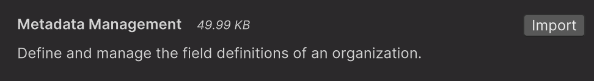
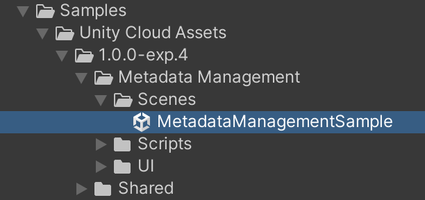
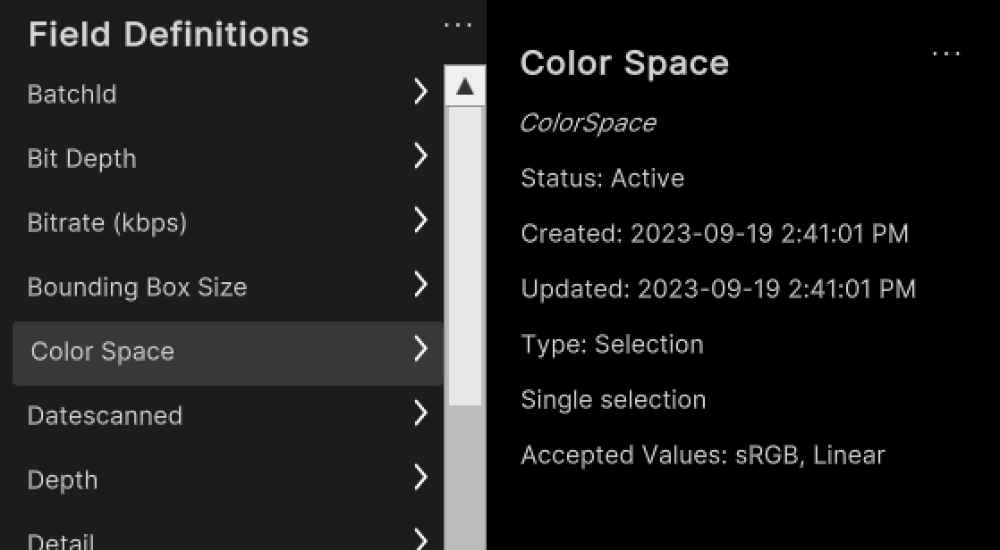
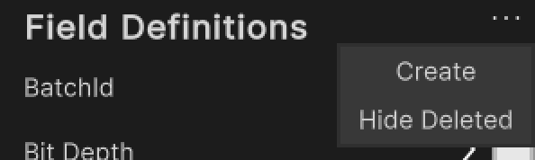
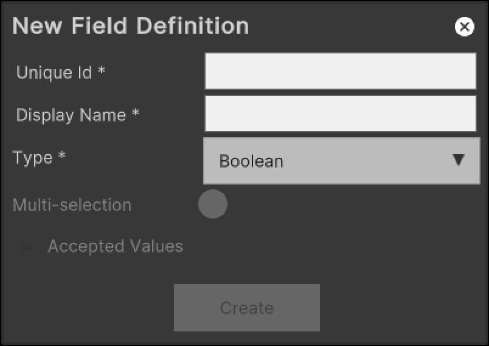
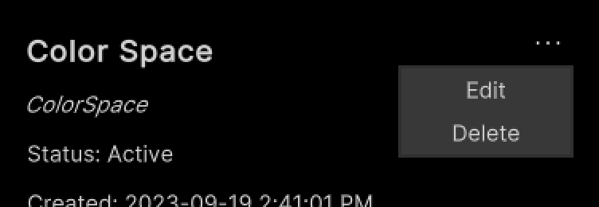
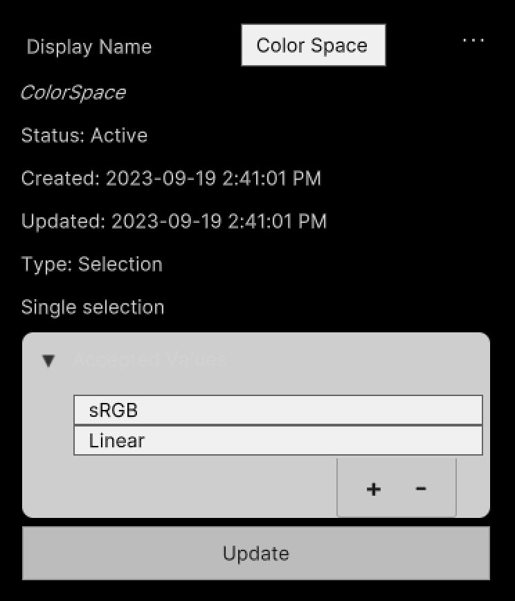

# Sample: Manage metadata field definitions

You can use the Metadata Management sample to list and manage the metadata field definitions in your organization.

>[!NOTE]
>To create, delete, and edit the field definitions of an organization, you need the [`Asset Manager Admin`](https://docs.unity.com/cloud/en-us/asset-manager/org-project-roles#organization-level-roles) role at the organization level.

## Before you start

Before you can use the Metadata Management sample, make sure you have the following:

* An installed [Assets](installation.md) package.
* An installed [Identity](https://docs.unity3d.com/Packages/com.unity.cloud.identity@latest) package.
* A valid [Unity ID Account](https://id.unity.com/).
* Access to your [Unity Gaming Services account](https://dashboard.unity3d.com/).
* A Unity Project with the Asset Manager service enabled. Read more about [creating a Unity project](https://docs.unity.com/cloud/en-us/asset-manager/new-asset-manager-project).
* Access to the [Asset Manager service](https://docs.unity3d.com/docs-asset-manager/manual/get-started.html)

>[!NOTE]
>Although the Assets package itself does not depend on the Identity service, this service is used in the sample to control the authentication process.

## Install the sample

To install the sample, follow these steps:

1. In your Unity Project window, go to **Package Manager** > **Unity Cloud Assets**.
2. Expand the **Samples** section.
3. On the right of the Collection Management sample, select **Import**.

   

4. After the import process completes, you can see the imported samples under the `Assets/Samples/Unity Cloud Assets` folder.

   

## Run the sample

To run the sample, follow these steps:

1. Go to `Assets/Samples/Unity Cloud Assets/<package-version>/Metadata Management/Scenes/MetadataManagementSample.unity` and run the scene.
2. Select an organization. The left column displays the list of field definitions from that organization.

   
   
3. Select a field definition to display its information.

   

### Create a new metadata field definition

To create a new field definition, follow these steps:

1. Next to the `Field Definitions` label, select the **...** button to open the shortcut menu.

   
   
2. Select **Create**.

   

3. Enter a unique ID and a display name for the field definition.
4. Select a type for the field definition.
5. (Optional) If you selected `Selection` as the type, enter the accepted values.
6. Select **Create**.

### Edit an existing metadata field definition

To edit an existing field definition, follow these steps:

1. Select an entry in the list.
2. Next to the display name, select the **...** button to open the shortcut menu.

   
   
3. Select **Edit**.

   
   
4. Enter a new display name for the field.
5. If the field is of the `Selection` type, update the list of accepted values.
6. Select **Update**.

#### Delete an existing metadata field definition

To delete an existing collection, follow these steps:

1. Select an entry in the list.
2. Next to the display name, select the **...** button to open the shortcut menu.

   

3. Select **Delete**.

## Main components

This section describes the scripts that make up the main components of the Metadata Management sample.

### Platform services script

The `PlatformServices` class handles the initialization and disposal of dependencies necessary for the `IAssetRepository` interface. You can use this class to retrieve the `IFieldDefinition` interface you want to modify.

To open the platform services script, go to your `Assets/Samples/Unity Cloud Assets/<package-version>/Shared/Scripts/Services/PlatformServices.cs` file.

The `PlatformServices` class includes two associated classes, `PlatformServicesInitialization` and `PlatformServicesShutdown`, which use Unity's standard `Monobehaviour` methods—`Awake()`, `Start()`, and `OnDestroy()`—to execute the initialization and shutdown methods.

### Field definition controller script

The `FieldDefinitionController` class inherits from the `OrganizationController` class, which enables signing into your application and uses your ID to grant access to the Collection Management sample. Read more about [authentication](https://docs.unity3d.com/Packages/com.unity.cloud.identity@latest).
The `FieldDefinitionController` class uses the `IOrganizationRepository` of the `PlatformServices` class to retrieve the list of your organizations.
The `FieldDefinitionController` class uses the `IAssetRepository` of the `PlatformServices` to retrieve the list of field definitions for the selected organization.

To open the field definition controller script, go to your `Assets/Samples/Unity Cloud Assets/<package-version>/MetadataManagement/Scripts/Controllers/Field.cs` file.

### Metadata management sample script

The `Metadata` shows you how to do the following:

* Integrate the login flow with the `FieldDefinitionController` class.
* Retrieve organizations and field definitions from the Asset Manager service.

To open the metadata management sample script, go to your `Assets/Samples/Unity Cloud Assets/<package-version>/MetadataManagement/Scripts/MetadataManagementSample.cs` file.

### Metadata field definition panel

The Metadata field definition panel includes the following components:

* The `FieldDefinitionPanelController` class displays the information of an `IFieldDefinition` interface.
* The `CreateFieldDefinitionPopupController` class displays the necessary fields to create a new field definition.

### Shared UI scripts

The `UI` sample includes a set of UI scripts and prefabs used by Unity Cloud Assets samples. To open shared UI scripts, go to `Assets/Samples/Unity Cloud Assets/<package-version>/Shared/Scripts/Controllers`.

## Troubleshooting

In case of issues with samples, refer to [troubleshooting](troubleshooting.md#sample-issues).
