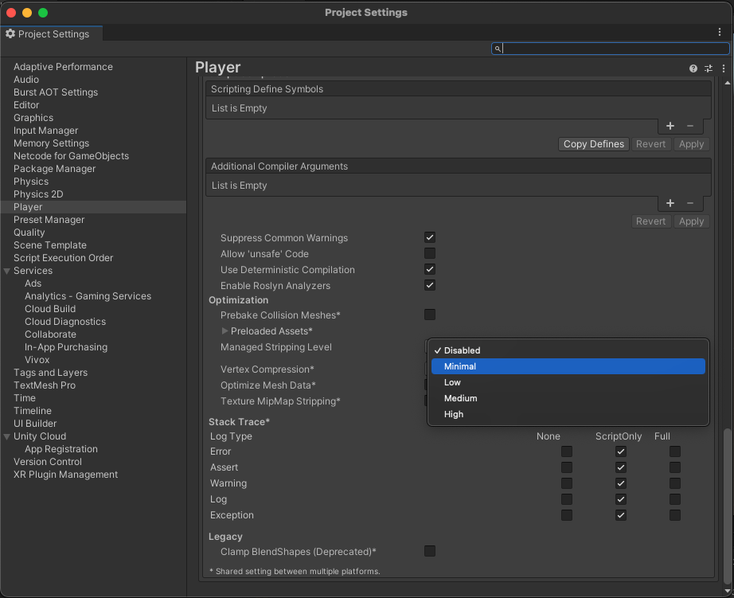

# Troubleshooting

This section describes errors or problems you can encounter when you use the Assets package.

## Getting started issues

**Runtime errors appeared when building the package**

To avoid runtime errors when building with this package, follow these steps:

1. In your Unity Project window, go to **Edit** > **Project settings**.   The Project setting window opens.
2. Select the **Player** option.
3. Scroll to the **Additional Compiler Arguments** section.
4. Set the **Managed stripping level** option to:

- **Disabled**
  or
- **Minimal** (if the **Disabled** option isn't available)

## Sample issues

### General sample issues

**A missing dependency error appeared when using the samples**

If you have dependency issues with the samples, refer to the **Before you start** section of the sample you're working with:

* [Asset Discovery sample](asset-discovery-sample.md#before-you-start)
* [Asset Management sample](asset-management-sample.md#before-you-start)
* [Collection Management sample](asset-collection-management-sample.md#before-you-start)

**The automatic browser redirection doesn't work**

If you run the sample in the Unity Editor, you should see the following page after you successfully login through your browser.

If the browser fails to redirect you to the Editor, and selecting **Launch Application**  does nothing, return to the Editor. Manually returning to the continues the authentication process.

**I can't see my assets**

If you can't see any assets, verify that your Organization have the asset management feature flag enabled. To enable the feature flag, [request access to the beta](https://docs.unity3d.com/docs-asset-manager/manual/request-access.html).
